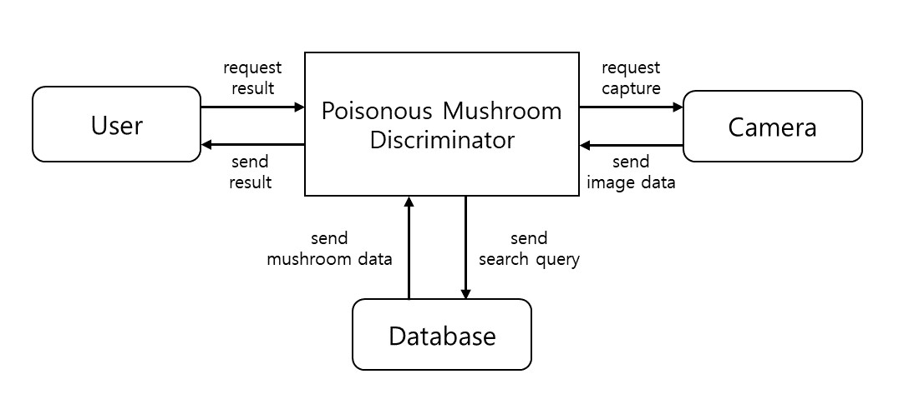

# 컨텍스트 다이어그램

* 컨텍스트 다이어그램

        - 시스템의 내부와 외부를 구분하며, 시스템과 상호작용하는 외부 개체를 명시
        - 구축할 시스템의 외부에는 무엇이 있으며, 해당 시스템과 실체로 상호작용하는 외부 개체는 무엇인지 표현
        - 시스템의 범위 확립
        - 시스템의 내부는 블랙박스
        
* 컨텍스트 다이어그램 작성 순서

        1) 구축할 시스템 외부의 관련 시스템이나 사용자 명시
        2) 구축할 시스템을 사각 박스로 표시
        3) 외부 개체와 구축할 시스템 사이의 관계를 표시(상호작용과 방향성)
        4) 모든 기호를 설명하기 위한 범례 표시
        
* 컨텍스트 다이어그램 옛날거

