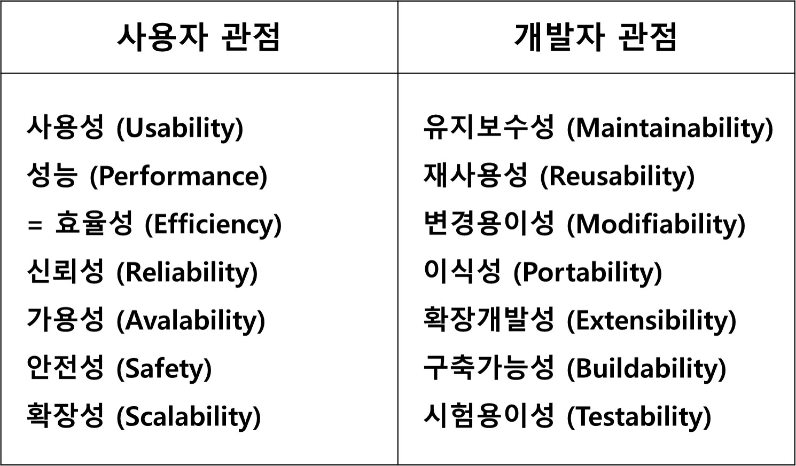

#소프트웨어 아키텍처 정의와 결정 요인

* 아키텍처란?

        - 어떤 대상의 주요한 특징을 추상화 하여 묘사한 것 (설계도, 지도)
        - 시스템의 논리적이고 구조적인 산출물
        
* 소프트웨어 아키텍처의 정의

        - 소프트웨어의 구성요소와 가시적인 속성, 구성요소 사이의 관계로 표현된 시스템의 전체적인 구조 또는 구조들
        - 시스템의 요소, 관계, 설계와 진화 원칙을 포함하는 시스템의 기본 개념 또는 특성이다.
            - A skeleton, not skin
            - More than structure
            - Embodies or addresses many "ilities"
            - Executable, therefore verifiable
            
* 소프트웨어 아키텍처 결정 요인

        - 아키텍처 드라이버: 아키텍처를 작성할 때 발생할 수 있는 결정 요인
            1) 기능 요구사항: 시스템이 반드시 수행해야하는 기능들
            2) 품질 요구사항(비기능; "ilities"): 소프트웨어 개발에 요구되는 품질 속성들(ex) 가용성, 성능, 보안, etc.)
            3) 제약 사항: 소프트웨어 개발 시, 사전에 결정된 사항들(ex) 기간, 비용, etc.)

* 품질 속성(Quality Attribute)

* 제약 사항
    
        - 기술적 제약 사항: 호환성, 특정 국제 표준 사용, 특정 언어 사용 등.
        - 조직적 제약 사항: 시간, 비용, 인력 등.
        - 비즈니스 제약 사항: 법률적인 제약, 회사 내규, 비즈니스 목표 등.