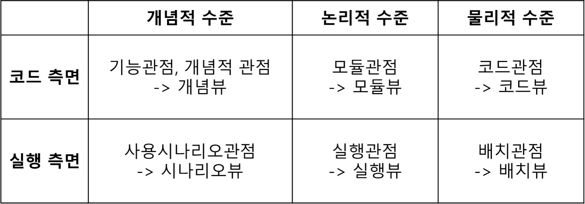

# 아키텍팅

* 아키텍팅의 주요 포인트
        
        -1. 추상화
        -2. Rationale
        
* 아키텍처 요소

        -1. 컴포넌트
        -2. 커넥터 (커넥션 컴포넌트)
        
* 아키텍처 뷰(view)와 뷰포인트(viewpoint)

        - 뷰포인트(viewpoint), 뷰타입(viewtype): 시스템을 아키텍처 수준에서 보는 관점 혹은 측면 (누가 보는가)
        - 뷰(view): 시스템을 이루는 요소와 그들의 연관관계를 추상적으로 표현 (어떤 데이터인가)
        
        - 관점에 따른 뷰의 종류:
            Static 관점: Classes, files, etc.
            Runtime 관점: thread, data flow, etc.
            Physical 관점: computers, actuators, etc.
            
        - 스타일(style): S/W 제약 사항을 표현할 수 있는 구성 요소와 연관관계의 특별한 type

* 뷰 타입
    

    
        코드측면 
            - 개념적 관점: 비전문가와도 의사소통이 가능한 개념적 수준의 아키텍처
            - 모듈관점: 시스템을 모듈로 분할하고 계층구조로 표현된 아키텍처
            - 코드관점: 소스코드를 버전, 종류, 디렉터리에 따라 배치 컴포넌트로 체계적으로 표현한 아키텍처
        실행측면
            - 사용시나리오관점: 최초의 시스템과 그 환경의 액터들의 상호작용으로부터 시스템의 아키텍처가 구체화되며, 
                              내부 컴포넌트들의 상호작용 시나리오로 구체화되어 다양한 뷰를 형성하고 연결
            - 실행관점: 컴포넌트들의 기능이 수행될 때, 개체와 관계 및 자료흐름, 상호통신 및 조직을 표현한 아키텍처
            - 배치관점: 배치컴포넌트들을 물리적 시스템 노드와 소프트웨어 플랫폼으로 배치를 표현한 아키텍처
            
* 뷰 타입-스타일

        - 모듈 뷰타입: Code units을 어떻게 구성할지
            1) 모듈분할 스타일(Module Decomposition Style): 
                - 모듈 사이의 포함관계에 초점
                - 변경 용이성(Modifiability), 성능(Performance)
                - 개발 혹은 구매 결정, 시스템 학습, 영향 분석(impact analysis)
                - 작업 할당 뷰의 기초자료, 형상 항목 정의 기준
                
            2) 사용 스타일(Uses Style): 
                - 모듈 사이의 기능적 의존관계 표시
                - 점증적 개발 계획 수립, 시스템 확장과 계획
                - 테스팅 및 디버깅 계획, 영향 분석

            3) 일반화 스타일(Generalization Style): 
                - 모듈 사이의 특수화/일반화관계 표시
                - 객체지향 설계, 확장과 진화
                - 지역적인 변경 또는 변이, 재사용
                
            4) 레이어 스타일(Layered Style):
                - 모듈 사이의 사용 허가 관계 표시
                - 수정 용이성, 이식성
                - 시스템 구축의 기준, 영향 분석
                        
        - 실행 뷰타입(C&C): system 요소들의 기능 실행과 상호작용을 어떻게 표현할지
            1) 파이프-필터 스타일(Pipe-Filter Style)
                - 데이터 스트림의 연속적 변환, 다중 포트를 통해 데이터 전송 가능
                - 컴포넌트=필터(관련 데이터면 처리 아니면 패스), 커넥터=파이프(데이터가 흐르는 통로)
                - 데이터 변환, 시스템 성능 추론
                
            2) 공유-데이터 스타일(Shared-Data Style)
                - 지속성을 가진 다양한 데이터 항목들이 다중 접근자를 가지는 경우
                - 고려사항: 성능,보안,프라이버시,신뢰성,호환성에 집중. 데이터분산과 중복.
                
            3) 클라이언트-서버 스타일(Client-Server Style)
                - 하나의 컴포넌트가 다른 컴포넌트의 서비스를 요청
                - 서버: 하나 이상의 인터페이스를 통해 서비스 제공, 하나 혹은 여러 대의 분산 서버
                - 클라이언트: 서버에 의해 제공되는 서비스 사용
                - 시스템 이해, 기능 그루핑, 기능 분할
                - 확실성(dependability), 보안, 성능
                
            4) 발행-구독 스타일(Publish-Subscrive Style)
                - 컴포넌트는 통보된 이벤트를 통해 상호작용
                - 발행: 이벤트를 통보하는 컴포넌트
                - 커넥터: 이벤트 버스, 적합한 컴포넌트에 이벤트 전달
                - 알려지지 않은 수신자에게 이벤트와 메시지 전송 가능
                
            5) 피어 투 피어 스타일(Peer-To-Peer Style)
                - 컴포넌트가 서비스를 교환하는 피어(Peer)로서 직접 상호작용
                - 대칭적인 상호작용
                - 커넥터: 복잡한 양방향 통신 및 프로토콜 포함
                - 분산 처리 시스템에 사용, 협력 영역에 의한 앱 분할 뷰 제공
                
            6) 통신-프로세스 스타일(Communicating-Processes Style)
                - 다양한 커넥터 메커니즘을 통해 병행 실행되는 컴포넌트 사이의 상호작용
                - 커넥터 메커니즘: 동기화, 메시지 패싱, 데이터 교환, 시작, 종료
                - 동시성 관련 행위를 이해하기 위해 사용
                - 성능, 신뢰성 분석
        
        - 할당 뷰타입: S/W요소들과 Non-S/W환경(외부환경)을 어떻게 mapping할지
            1) 배치 스타일(Deployment Style)
                - 소프트웨어가 실행되는 하드웨어에 컴포넌트와 커넥터 매핑
                - 성능, 신뢰성 분석
                - 비용 예측, Enterprise deployment 확보
                
            2) 구현 스타일(Implementation Style)
                - 파일 시스템에 모듈 매핑
                - 개발 및 빌드에 이용
                - 버전 차이 명시, 특별한 목적을 위한 요소 강조, 형상 관리 분석 
                
            3) 작업 할당 스타일(Work assignment Style)
                - 사람, 그룹, 팀 작업에 모듈 매핑
                - 팀 자원 할당 및 관리와 프로젝트 구조 설명
                - WBS(Work Breakdown Structure)와 상세 예산 및 스케줄 예측 기반 자료
                